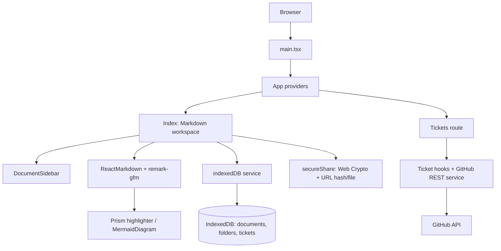
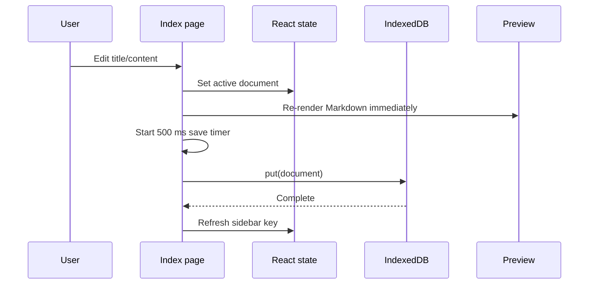

# Smart MD Viewer Audit

**Audit date:** 2026-07-30  
**Scope:** all tracked application, configuration, workflow, documentation, and application-owned UI files. shadcn/Radix primitives under `src/components/ui/` were inventoried as vendor-derived primitives and not treated as bespoke architecture unless the application uses them.

## Executive Summary

Smart MD Viewer is a client-only React/Vite workspace with solid local-first foundations: IndexedDB documents and folders, GFM preview, Mermaid rendering, encrypted document sharing, workspace import/export, themes, and a separately routed ticket/GitHub feature. It is not yet positioned as a best-in-class Markdown *viewer*: the default is split authoring, there is no local `.md` open/drop/paste flow, no table of contents or reading controls, no math/frontmatter support, and no PWA service worker.

The immediate launch blockers are user-data safety and initial-load performance. Folder deletion can orphan documents, workspace import lacks schema validation, a pending autosave is not cleaned up on unmount, and the initial JavaScript bundle is **1,918.82 kB minified / 602.69 kB gzip**. The app should first establish a safe, reader-first document lifecycle and code-split heavy rendering/tooling before adding advanced features.

**Launch readiness: 4.8 / 10.** The core works locally, but reliability, accessibility, performance, testing, and viewer-first parity need work before a competitive launch.

## Evidence and Validation

| Area | Result |
| --- | --- |
| Build | `npm run build` succeeds; 4,589 modules transformed. |
| Lint | `npm run lint` exits successfully with 7 `react-refresh/only-export-components` warnings in shadcn-derived UI primitives. |
| Main JS | 1,918.82 kB minified / 602.69 kB gzip; Vite emits a >500 kB warning. |
| Main CSS | 81.65 kB minified / 13.32 kB gzip. |
| Heavy dependencies | Mermaid emits large diagram chunks; Prism syntax highlighting, Mermaid, ticket UI, and application routes are imported eagerly by the main app. |
| Automated tests | None configured. CI runs lint and build only. |
| PWA | No web app manifest, service worker, or offline asset caching. |

## Architecture and Data Flow

### Current implementation

- `App.tsx` installs Router, TanStack Query, theme, tooltip, and two toast providers. Query is not used by the Markdown workspace.
- `pages/Index.tsx` is the editor/workspace controller (966 lines). It owns rendering, document CRUD, tags/folders, exports, workspace backup, sharing, and most UI.
- `lib/indexedDB.ts` provides direct IndexedDB functions for documents, folders, and tickets. It has no runtime schema validation, transaction completion handling, or cross-tab coordination.
- `DocumentSidebar.tsx` loads all documents/folders, recursively builds the tree, and searches documents in memory. The async `useMemo` pattern introduces an avoidable Promise state path.
- Markdown passes through `react-markdown` and `remark-gfm`; fenced Mermaid is rendered by `MermaidDiagram`; Prism syntax highlighting is rendered synchronously for all matched code blocks.
- Mermaid is initialized in both `Index.tsx` and `MermaidSandbox.tsx`. The former uses `securityLevel: "loose"`; the diagram component injects Mermaid input using `innerHTML` before rendering.
- Sharing serializes a document, optionally compresses it, derives AES-GCM keys through PBKDF2-SHA-256 (600,000 iterations), and stores encrypted data in a URL hash or `.smdshare` file. The passphrase is not carried in the link.
- Tickets are independently routed, persist locally, and can call GitHub using a user-supplied PAT. The ticket/GitHub feature should remain functional but is not a product-investment priority.

## Feature Inventory

| Feature | Related files | Quality | Findings and next improvement |
| --- | --- | ---: | --- |
| Document CRUD and autosave | `Index.tsx`, `indexedDB.ts` | 6/10 | Functional 500 ms debounce; add unmount flush/cancel, failures, conflict handling, and a reusable document controller. |
| Folder, tags, pins, search | `DocumentSidebar.tsx`, `indexedDB.ts` | 5/10 | Search loads all content; folder deletion leaves children/documents orphaned; add safe deletion policy and indexed/query-aware UX. |
| GFM preview | `Index.tsx`, `index.css` | 6/10 | Tables/tasks/code work; add reader mode, TOC, anchored headings, responsive tables, callouts, and controlled rendering policy. |
| Mermaid preview/sandbox | `MermaidDiagram.tsx`, `MermaidSandbox.tsx` | 5/10 | Broad capability but eagerly loaded and duplicated setup; lazy-load, isolate failures, use strict security configuration, and split the 871-line sandbox. |
| Markdown/PDF/Word export | `Index.tsx` | 4/10 | Markdown works; PDF delegates to browser print; Word exports preview `innerHTML` and can produce inconsistent/untrusted markup. Add print stylesheet and deliberate export contracts. |
| Workspace import/export | `Index.tsx`, `indexedDB.ts` | 4/10 | ZIP backup works for happy path; nested paths are lost, names are unsanitized, import is unvalidated and not atomic. |
| Encrypted sharing | `secureShare.ts`, `Index.tsx` | 7/10 | Strong browser-native cryptography and useful file fallback; add envelope limits, capability detection, tests, and explicit privacy/browser support documentation. |
| Theme system | `App.tsx`, `ThemeToggle.tsx`, `index.css` | 6/10 | Class-based light/dark design tokens; default disables system preference and toolbar controls lack visible labels. |
| Ticket/GitHub workflow | ticket components/hooks, `github.ts` | 5/10 | Broad scope but unrelated to reader-first promise; preserve and regression-test, isolate its route, and treat PAT persistence/security as a separate hardening issue. |
| Deployment/SEO | `vite.config.ts`, `index.html`, workflows | 4/10 | GitHub Pages build works; title/description/robots exist, but no canonical URL, sitemap, OG image, manifest, or route/server strategy beyond SPA assumptions. |

## UX and Accessibility Audit

| Area | Score | Findings |
| --- | ---: | --- |
| Navigation/discoverability | 5/10 | The default blank workspace invites creation rather than opening/reading a file; ticket and diagram actions compete with core reading. |
| Reader experience | 3/10 | Default split view, no focus mode, TOC, font/line-width controls, or long-document navigation. |
| Editing | 6/10 | Clear code/preview/split modes, but no editor enhancements, draft recovery notice, unsaved state, or keyboard save behavior in the main editor. |
| Responsive/touch | 5/10 | Utility layout is responsive in places; wide Markdown tables, split panes, hover-only affordances, and right-click context menus are weak on touch. |
| Keyboard | 4/10 | Dialog primitives help, but sidebar tree uses clickable `div`s instead of buttons/tree semantics, and core actions lack documented shortcuts. |
| Screen readers | 4/10 | Icons are frequently paired with text, but several icon-only buttons rely on `title`; document/folder rows and tag badges are not semantic controls. |
| Themes/contrast | 6/10 | Tokens are coherent; verify contrast and syntax themes with automated checks. System preference is intentionally disabled. |
| Empty/loading/error states | 5/10 | Main empty state is present; IndexedDB/sidebar failures, malformed workspace contents, and rendering fallbacks need visible actionable states. |

## Performance Audit

1. **Critical — initial bundle and eager feature loading.** The 1.9 MB entry contains core workspace plus heavy libraries. Lazy-load ticket route, Mermaid sandbox, Mermaid renderer, and syntax highlighter; use route/component boundaries and a bundle budget.
2. **High — synchronous preview work per keystroke.** Every edit immediately rebuilds React Markdown and may invoke Prism/Mermaid. Debounce/defer rendering, cache parsed/rendered subtrees, and avoid rendering diagrams until preview is active/visible.
3. **High — all-document reads and recursive tree.** Sidebar fetches all documents/folders; search scans all content and rebuilds tree on each refresh. Replace the `key` remount with subscription/state refresh, index/filter deliberately, and virtualize if document counts require it.
4. **Medium — duplicate Mermaid initialization and sandbox scope.** A large 871-line component owns persistence, render scheduling, keyboard commands, image export, pan, and zoom. Split it and load only on demand.
5. **Medium — avoidable UI providers/dependencies.** TanStack Query and dual toaster systems add cognitive/runtime cost where local state is used; verify actual imports before removal.

## Security and Reliability Audit

- **High:** Set Mermaid to a restrictive security policy and avoid assigning untrusted diagram text with `innerHTML`; maintain a documented sanitization/trust boundary for Markdown and exported HTML.
- **High:** Validate workspace ZIP metadata and every record before persistence; enforce limits and use a single transaction whose completion decides success. Current imports overwrite by ID and may partially persist.
- **High:** Define folder deletion behavior (cancel, move contents to root, or recursive delete with confirmation) before it can strand data.
- **Medium:** Flush or cancel the document autosave timer on unmount/document switch and surface `saveDocument` failures. Current delayed writes can outlive UI lifecycle.
- **Medium:** Audit GitHub PAT lifecycle in `useGitHub.ts`; never persist a raw token in localStorage. Prefer session-only storage and fine-grained tokens, and explain that static hosting cannot protect a client-side secret.
- **Medium:** Sanitize exported filenames and workspace paths; escape Word-export document title/content instead of serializing DOM `innerHTML` as a trust boundary.
- **Low:** Sharing cryptography is well chosen, but compression/decompression requires browser feature detection and user-facing fallback messaging.

## Platform, Offline, and SEO

- **Browser compatibility:** baseline modern Chromium, Firefox, and Safari is reasonable for IndexedDB, Web Crypto, and React. `CompressionStream`/`DecompressionStream`, Clipboard, `crypto.randomUUID`, and print/export need explicit compatibility checks and fallback UI.
- **Offline:** persisted documents work after the app is cached by the browser, but first-load/offline navigation is not guaranteed without a service worker. There is no storage-quota, IndexedDB-unavailable, or migration recovery UX.
- **PWA:** not PWA-ready. Add manifest, install metadata/icons, service worker/update flow, offline app shell, and automated offline tests.
- **SEO:** static metadata and robots exist. Add canonical URL, robots/sitemap ownership, Open Graph/Twitter images, share-safe metadata, accessible page hierarchy, and indexable reader routes only if public publishing is introduced.

## Technical Debt and Refactoring Opportunities

- Break `pages/Index.tsx` into workspace shell, document controller, import/export/share actions, toolbar, reader, and editor components.
- Break `MermaidSandbox.tsx` into renderer, templates/storage, viewport controls, export actions, and dialog shell.
- Replace fire-and-forget IndexedDB wrappers with shared request/transaction helpers that resolve on `transaction.oncomplete` and reject on abort/error.
- Replace `DocumentSidebar`’s asynchronous `useMemo`, recursive non-memoized tree building, and `key={refreshSidebar}` remount trigger with explicit state/query invalidation.
- Remove the unused Vite starter stylesheet `App.css` after visual verification; review package usage before pruning unused dependencies/primitives.
- Add tests before refactoring persistence or sharing; current CI cannot detect behavioral regression.

## Audit Limits

This is a static and build-level audit. It did not use real user documents, GitHub credentials, cross-browser device farms, accessibility automation, or production telemetry. Those are explicit roadmap verification tasks, not claims of current behavior.
