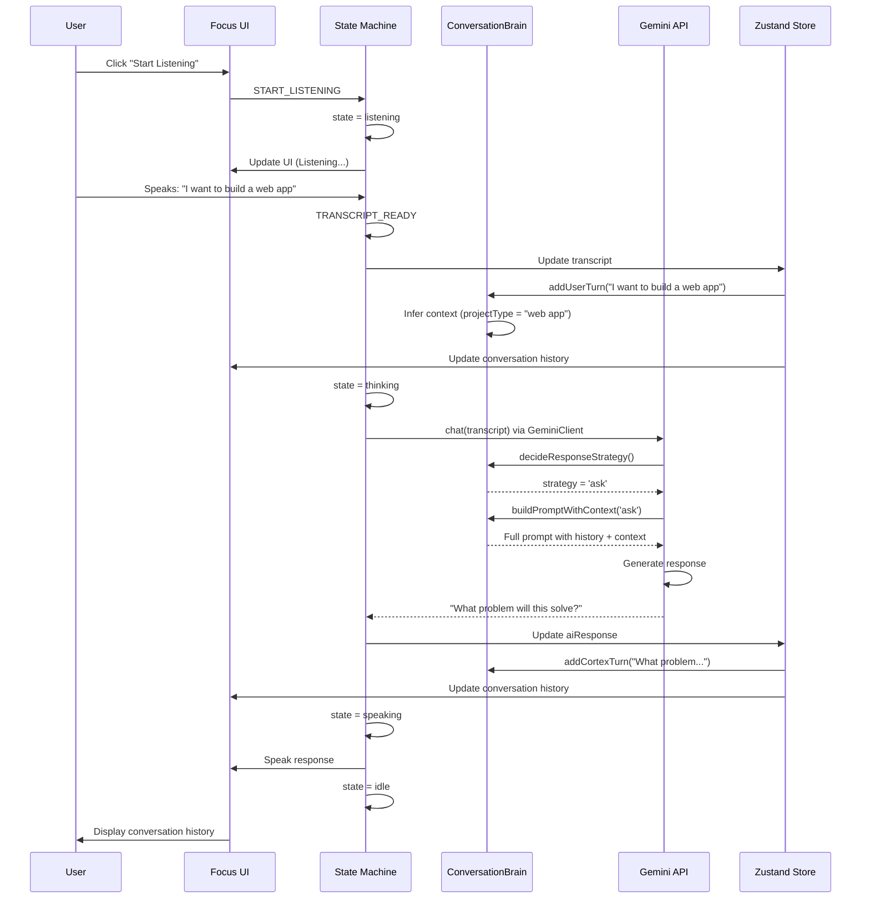
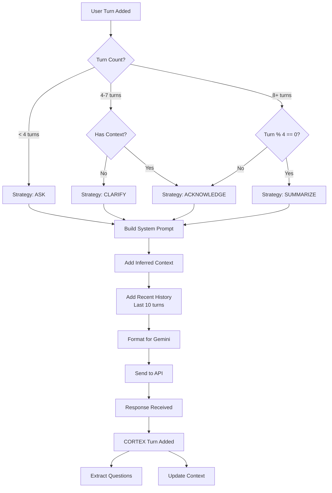
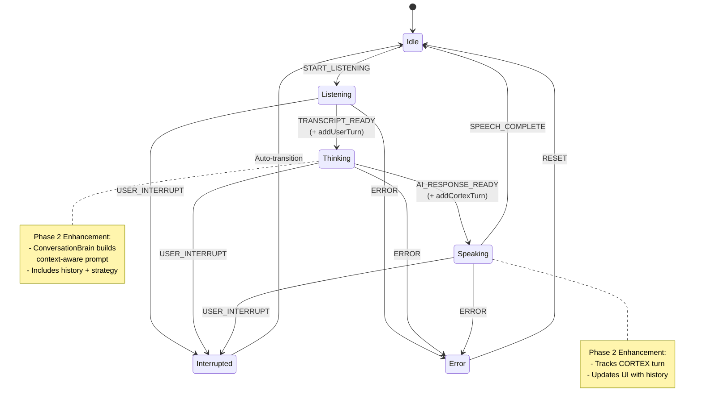
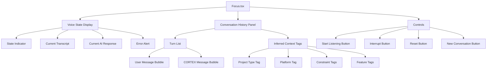
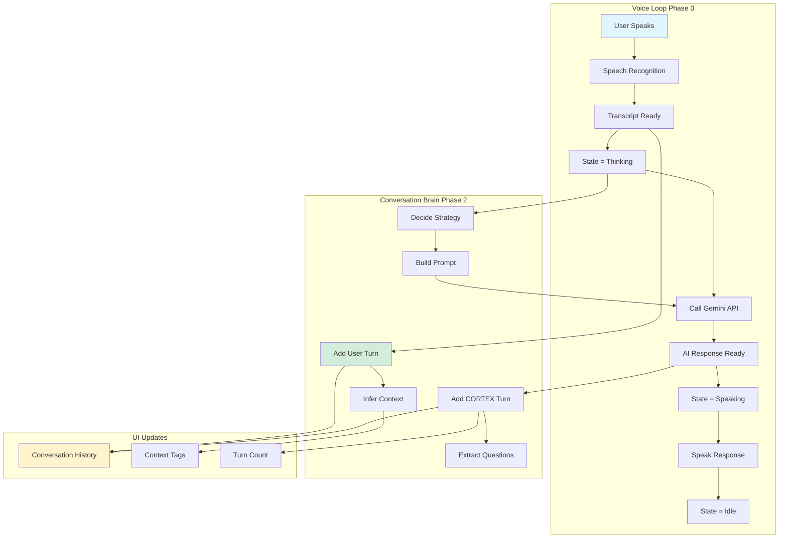

# Phase 2: Conversation Flow Diagrams

## High-Level Conversation Flow



## ConversationBrain Internal Flow



## State Machine Integration (Phase 0 + Phase 2)



## Context Inference Pipeline

```mermaid
graph LR
    A[User Input:<br/>"React web app<br/>with auth"] --> B[ConversationBrain]
    
    B --> C[Project Type<br/>Detector]
    B --> D[Platform<br/>Detector]
    B --> E[Feature<br/>Detector]
    B --> F[Constraint<br/>Detector]
    
    C --> G{Keywords Match?}
    G -->|"web app"| H[projectType = "web app"]
    
    D --> I{Keywords Match?}
    I -->|"react"| J[platform = "React"]
    
    E --> K{Keywords Match?}
    K -->|"auth"| L[features += "authentication"]
    
    F --> M{Keywords Match?}
    M -->|No matches| N[No constraints]
    
    H --> O[InferredContext]
    J --> O
    L --> O
    N --> O
    
    O --> P[Display Context Tags]
    O --> Q[Include in Gemini Prompt]
```

## UI Component Hierarchy



## Data Flow: Voice Loop → Conversation State



## Response Strategy Decision Tree

```mermaid
graph TD
    A[New Turn Received] --> B{Turn Count < 4?}
    B -->|Yes| C[ASK Strategy<br/>Exploratory questions]
    B -->|No| D{Turn Count < 8?}
    
    D -->|Yes| E{Has Context?}
    D -->|No| F{Turn % 4 == 0?}
    
    E -->|No| G[CLARIFY Strategy<br/>Resolve ambiguities]
    E -->|Yes| H[ACKNOWLEDGE Strategy<br/>Accept and pivot]
    
    F -->|Yes| I[SUMMARIZE Strategy<br/>Recap understanding]
    F -->|No| H
    
    C --> J[Gemini Prompt:<br/>"Ask about core aspects"]
    G --> K[Gemini Prompt:<br/>"Clarify unclear details"]
    H --> L[Gemini Prompt:<br/>"Acknowledge and continue"]
    I --> M[Gemini Prompt:<br/>"Summarize understanding"]
    
    style C fill:#ffeb3b
    style G fill:#ff9800
    style H fill:#4caf50
    style I fill:#2196f3
```

---

## Example Flow Visualization

**Scenario: User wants to build a React web app**

```
Turn 1:
User: "I want to build a web app"
  → ConversationBrain.addUserTurn()
  → Infer: projectType = "web app"
  → Strategy: ASK (turn 1)
  → Prompt includes: "Ask about core aspects"
CORTEX: "What problem will this solve?"

Turn 2:
User: "Task management for developers"
  → ConversationBrain.addUserTurn()
  → Infer: features += "task management"
  → Strategy: ASK (turn 2)
CORTEX: "Will this be personal or for teams?"

Turn 3:
User: "Personal tool using React"
  → ConversationBrain.addUserTurn()
  → Infer: platform = "React", teamSize = "solo"
  → Strategy: ASK (turn 3)
CORTEX: "Are you planning to use a backend?"

Turn 4:
User: "No backend, just GitHub Pages"
  → ConversationBrain.addUserTurn()
  → Infer: constraints = ["no backend"]
  → Strategy: SUMMARIZE (turn 4, turn % 4 == 0)
CORTEX: "Got it - a React task manager for personal use, static hosting on GitHub Pages. What features matter most?"

Turn 5:
User: "Simple task lists and deadlines"
  → ConversationBrain.addUserTurn()
  → Infer: features += ["task lists", "deadlines"]
  → Strategy: ACKNOWLEDGE (turn 5)
CORTEX: "Makes sense. Do you need notifications for upcoming deadlines?"
```

**Context After Turn 5:**
```json
{
  "projectType": "web app",
  "platform": "React",
  "constraints": ["no backend"],
  "features": ["task management", "task lists", "deadlines"],
  "teamSize": "solo"
}
```

---

These diagrams visualize the complete Phase 2 architecture and conversation flow!
